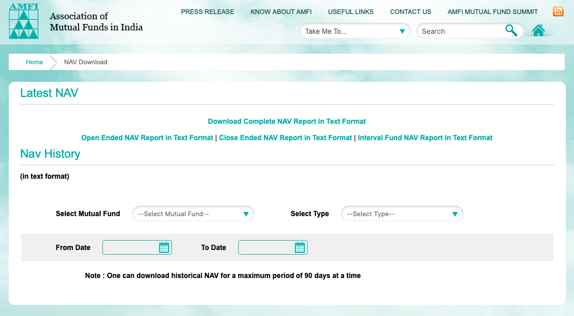
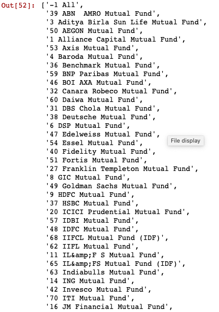
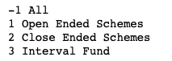
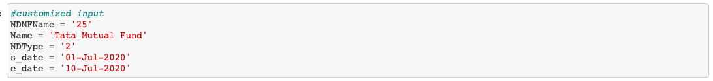
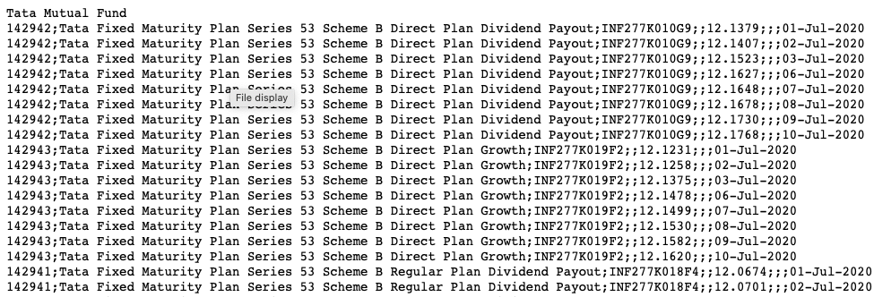

# assessment-areix

I have chosen and finished programming assignment.

## task 1 - Dynamic Programming

This problem is trying to output maximum production with the increasing array/list [1,2,3, ... ]

#### Analysis

As our goal is to produce the maximum of the products, we try to put the higher satisfaction at the end of the list! Then we just need to compare the result of products with a different start.

#### My solution:

- first, I tried to sort the satisfaction list
- second, set the default output if all satisfaction is non-positive
- third, I tried to compare the products starting at each satisfaction element

#### Result:

As you can see that the outputs are the same with the examples.

## task 2 - Stack, 2 pointers

This problem is trying to output the water contained by the container created by our number lists.

#### Analysis

divide and conquer
I would divide the problem into a series of sub-problems to get the water contained in each column.
By getting the water for every column, the sum will be the result

#### My solution

for each column, the water hold is decided by the left and right barrier. Thus I try to find the left highest wall and the right highest wall, then the minumum of both wall would decide the water could be hold at the current column, of course we need to subtract the wall/stones already in our current column.

The sum of water in each column will be the result.

#### Result:

As you can see that the outputs are the same with the examples.
I have also tried some other examples yielding correct results.

## Task 3 - Data Collection

I used Web scrapping to get the mutual fund data on the AMFI website and output the data into a text file n the format of Json to show my web scrapping ability.

#### Analysis

As you can see from this website, one needs to choose mutual fund, type and starting and end date or the information we want.

Thus I have scrapped such information and output the selection list for your reference.

The following picture shows the mutual funds you could choose from with the index and its corresponding name.

The following picture shows the Type you could choose with its index and its corresponding type name.

The following snippet is part of my code designed to allow our staff write down cusmized input and then my program will scrap the data from the website and store them into the file in the format of JSON.

#### Example

Here, I would like to show an example as a guidance:
Our task is to find the date for the Tata Mutual Fund, Close Ended Schemes from 01-Jul-2020 to 10-Jul-2020.
By examining the mutual fund list,
we can see that the Tata mutual fund index is 25 and
the Close Ended Schemes has index 2
Thus, we could input our data like this:

Then my program will extract the data:

